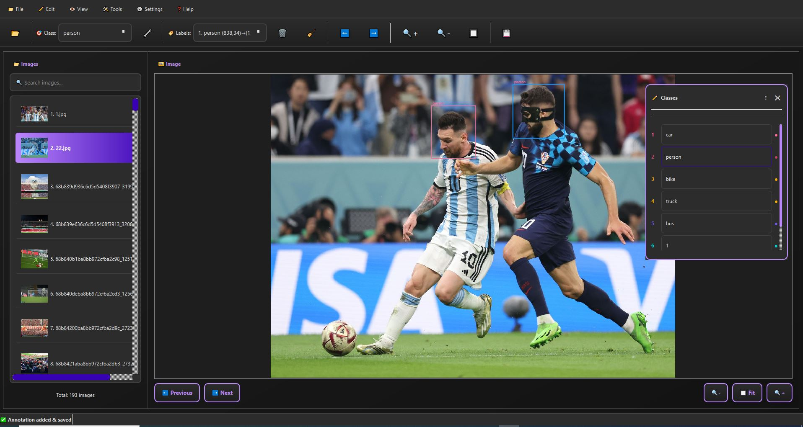
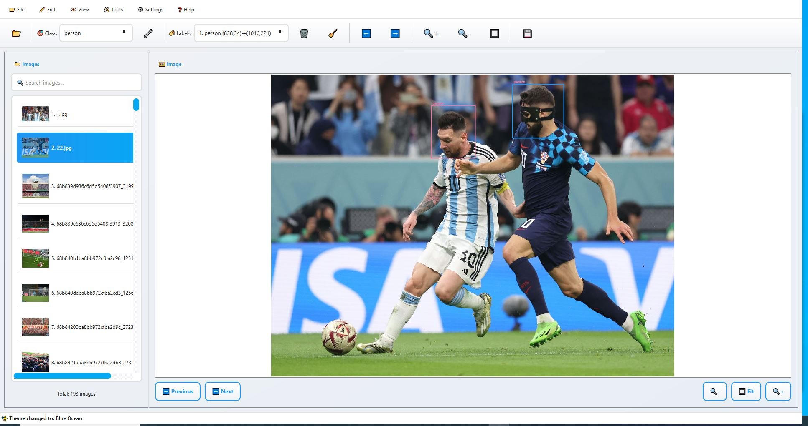

🖼️ LabelTrain

LabelTrain** is a modern, lightweight image annotation tool built for speed, simplicity, and flexibility.  
It provides an intuitive interface for labeling objects in images and exporting annotations in popular formats such as **YOLO**, **Pascal VOC**, **COCO**, and **CSV**.

---

✨ Key Features
🎨 Modern & Customizable UI
- Sleek design built with **PyQt6**
- Multiple color themes (Blue Ocean, Dark Mode, Purple Dream, and more)
- Smooth animations and responsive layout

🧰 Advanced Annotation Tools
- Create, edit, move, and delete bounding boxes with ease
- Resize and drag annotations directly on the image
- Right-click context menu for quick actions
- Zoom, pan, and fit-to-window support for large images

🧩 Flexible Class Management
- Add, rename, delete, and reorder classes
- Includes **preset categories** (person, car, dog, etc.)
- Floating class panel for fast switching and editing

💾 Multiple Export Formats
- **YOLO (.txt)**
- **Pascal VOC (.xml)**
- **COCO (.json)**
- **CSV (.csv)**

⚙️ Smart Workflow
- Autosave and resume your last session
- Export progress tracking with detailed status
- Multithreaded export to prevent UI freezing

🖥️ Cross-Platform Support
Runs smoothly on **Windows**, **Linux**, and **macOS**.

---

Why LabelTrain?
LabelTrain is designed to balance **ease of use**, **modern design**, and **practical functionality**.  
Whether you're preparing datasets for computer vision, deep learning, or academic research — LabelTrain helps you focus on your work, not on the tool.

---

📦 Supported Formats Summary

| Format       | Extension | Description                  |
|---------------|------------|------------------------------|
| YOLO          | `.txt`     | Center-based coordinates      |
| Pascal VOC    | `.xml`     | XML-based object annotations  |
| COCO          | `.json`    | Standardized JSON dataset     |
| CSV           | `.csv`     | Simple tabular annotations    |

---

💡 Coming Soon
- Polygon and segmentation support  
- Dark-mode auto-switch  
- Cloud project sync  

---

> **LabelTrain** — Designed for creators, researchers, and developers who value clarity, performance, and modern design.
